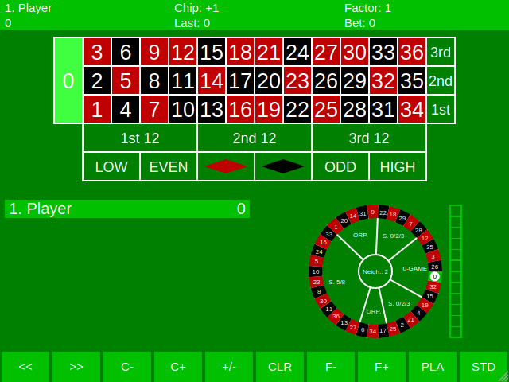
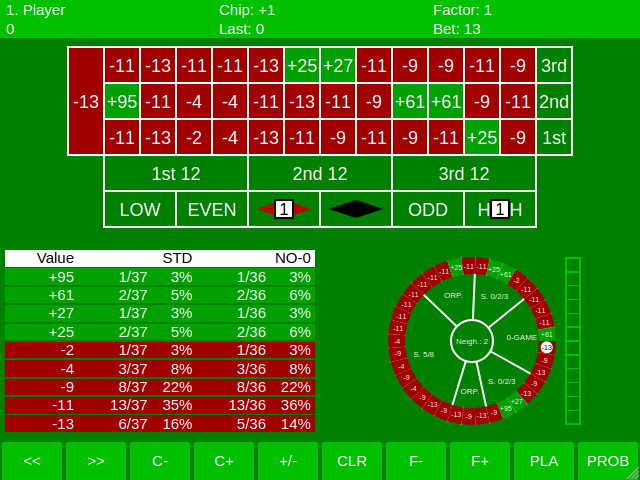

# Roulette 3\-in\-1

There is HTML/JS based application, which allows to play the roulette game in every HTML5 complaint web browser\. This application uses SVG format to display interface and can be fit to any resolution or window size\.

The application contains three roulette games, which can be played by several players and has the same rules, as in the most casinos in the world:

* *Classic roulette* \- The classical european roulette with 36 numbers and one zero\. This game supports the wheel standard sectors bets known as racetrack\.
* *Mini roulette* \- Roulette with 12 numbers and zero\. If the zero is hit, for all bets, which not includes the zero there are lost only half of value\.
* *100 roulette* \- Roulette with 100 numbers, in place of zero, there are five letters\.

After running the application you can select the game or display detailed information by clicking the **Help** field\.

To run the game, click the one of upper three fields\. To reset the game, refresh or restart application at least three times\.

You can play the game in one of four methods \(the method can be changed everytime during the game\):

* **Standard** \- The change of hitting every field is the same as in the regular casino\. The 0 or letters are not regular numbers and provides the house edge\.
* **Non\-zero** \- In the spin, only numbers can be hit, the 0 or letters can not be hit\. Game in this mode does not have the house edge\.
* **Select** \- Player can choose the number, this mode can be used to tests and simulations\.
* **Probability** \- Display win and lose probability and how much player will win or lose for each field\.

You can place the chips both on the table as in regular game and on the wheel to mage neighbor bets\.

# Classic roulette

There is the oldest and most popular roulette in the world\. The table contains the 37 fields \(36 numbers and the 0\) for inside bets and 13 places to outside bets including the Snake bet\.

There are the all possible chip places on the table markered as blue rectangle:

You can place the chips on the wheel fields and on the sectors inside the wheel as racetrack bets in regular casino\. By clicking in the middle of the wheel, you can specify number of neighbors\.

# Mini roulette

There is miniaturized and simplified derivative of *Classic roulette*\. The 0 field provides different result against the other games\. If the 0 is hit, you lose only the half of chips places outside the 0 field\. There is the reason, why in the **Mini roulette**, player can place only even chip value\.

In the application, there are removed some outside bet fields, which exists in regular game:

* **ODD**, **EVEN** \- The bet for odd is the same as bet for red and the bet for even is the same as bet for black\.
* **1\-6**, **4\-9**, **7\-12** \- There are possible the same inside bets for 6 numbers\.

Removing the fields does not decrease the bet abilities, but increases the table fitting\.

The places on the table, where you can place the chips\. You can also place the chips on the fields of the wheel as in *Classic roulette*, but the *Mini roulette* does not have racetrack\.

# 100 roulette

There is the **Classic roulette** derivative, which has the followin differences:

* 100 numbers instead of 36 numbers\.
* 5 letter fields instead of 0 field\.
* No racetrack \(but neighbor bets are possible\)\.
* Bet for 2 columns\.
* Bet for all letters\.
* The outside bets are the columns, odd/even and red/black\.

The game is also known as **101 roulette** and **100/1 roulette**\. The wheel has 105 fields, so is drawn in three rings, with 35 fields per ring\.

On the table there are possibles to place the chips, whichs are marked by blue rectangle\.

The view on the zoomed table with all chip places\.

# Probability

The application have probability mode\. In normal mode, you can place chips as following for example:

* 3 chips for straight \{2\}
* 1 chip for corner \{7, 8, 10, 11\}
* 2 chips for split \{18, 21\}
* 4 chips for corner \{25, 26, 28, 29\}
* 1 chip for straight \{31\}
* 1 chip for Red
* 1 chip for High

As you can see, the whole bet is 13:

In the probability display mode, you can see how balance will be changed for each number and value probability summary\. The chips on the inside bets are hidden and will be shown after returning to normal display mode\.

As you can see, you can read the followin informations for example:

* If number 2 will hit, you will win 95\.
* If number 21 is hit, you will win 27\.
* If one of the numbers \{8, 10, 11\} will hit, you will lose 4\.
* If one of the numbers \{4, 6, 13, 15, 17\} will hit, you will lose 13\.
* You have 3% chance to win 95\.
* You have 35% chance to lose 11 in standard game\.
* The highest possible value to lose in this game is 13, with 16% chance in standard game or 14% chance in non\-zero game\.

# Game state persistence

The game state is always stored in web browser's local storage\. The application can be restarted only if you refresh is three times without any action between refreshes\. This feature avoids losing the game state if you accidentally close the browser, refresh or open another web page\.

